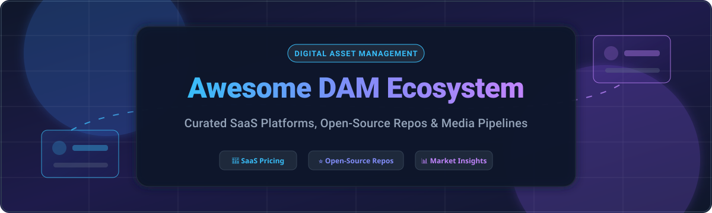

  

# 📂 Awesome Digital Asset Management (DAM) Ecosystem 🚀

  
  
  
  

> 🌟 A comprehensive, SEO-optimized curated list of top SaaS products and Open-Source GitHub projects for **Digital Asset Management (DAM)**, content operations, brand governance, and media delivery pipelines.

**📅 Last updated: October 2026**

🖼️ **Digital Asset Management (DAM)** software centralizes photos, videos, documents, and creative assets — providing metadata indexing, full-text search, version control, dynamic media processing, and automated CDN delivery for marketing, creative, e-commerce, and enterprise content teams.

---

## 📋 Table of Contents 📑

- [📈 Market Size & Industry Dynamics](#-market-size--industry-dynamics)
- [☁️ SaaS & Hosted DAM Platforms](#%EF%B8%8F-saas--hosted-dam-platforms)
- [🔓 Open-Source GitHub Projects](#-open-source-github-projects)
- [🤝 How to Contribute](#-how-to-contribute)
- [💖 Support & Sponsorship](#-support--sponsorship)
- [📈 Star History](#-star-history)
- [⚠️ Disclaimer](#%EF%B8%8F-disclaimer)

---

## 📈 Market Size & Industry Dynamics 📊

The global Digital Asset Management (DAM) market size is estimated at **$5.3 Billion in 2026** (projected to reach over **$9.6 Billion by 2030** growing at a CAGR of ~13.5%). The sector is **moderately fragmented**, featuring a mix of multi-billion-dollar cloud suites (such as Cloudinary, Acquia, and Bynder) alongside specialized mid-market solutions and a rapidly expanding ecosystem of self-hosted open-source platforms.

---

## ☁️ SaaS & Hosted DAM Platforms 🌐

Below is a curated comparison of leading SaaS Digital Asset Management platforms, sorted by **company size (revenue / valuation, descending)**.

| Platform | Valuation / Revenue 💰 | Starting Price 💵 | Free Tier / Trial Limit 🎁 | Description 📝 |
| :--- | :--- | :--- | :--- | :--- |
| **[Cloudinary](https://cloudinary.com/)** | **$2.0 Billion Valuation** (~$94M ARR) | $49/month (Plus Plan) | Free-forever plan (25 monthly credits: 25K transformations or 25GB storage/bandwidth) | Media management and transformation platform with URL-based image/video optimization, AI tagging, and CDN delivery. |
| **[Frontify](https://www.frontify.com/)** | **$1.7 Billion Valuation** (~$50M ARR) | ~$490/month ($5,880/year starting) | 14-day free trial (Full feature access, no credit card required) | All-in-one brand management platform combining DAM with brand guidelines, design templates, and workflow collaboration. |
| **[Acquia DAM](https://www.acquia.com/products/dam)** | **$1.0 Billion Valuation** (~$200M ARR) | ~$1,500/month ($18,000/year starting) | 14-day custom demo trial (Available upon request with sales team) | Enterprise DAM (formerly Widen) deeply integrated with Drupal, offering brand portals, governance, and marketing automation. |
| **[Bynder](https://www.bynder.com/)** | **$600 Million Valuation** (~$130M ARR) | ~$450/month ($5,400/year starting) | 14-day free trial (Guided sandbox environment upon sales registration) | Enterprise DAM with brand templating, creative workflow automation, analytics, and self-hosted license options. |
| **[Brandfolder](https://brandfolder.com/)** | **$155 Million Valuation** (Acquired by Smartsheet, ~$24M ARR) | ~$1,250/month ($15,000/year starting) | 14-day free trial (Available for verified business email registrants) | Digital asset management platform featuring AI-powered auto-tagging, brand portals, and native integrations with creative workflows. |
| **[Aprimo](https://www.aprimo.com/)** | **$90 Million Valuation** (Acquired by Marlin Equity) | ~$2,000/month ($24,000/year starting) | 30-day trial environment (Provided via enterprise demo request) | Enterprise-grade marketing operations and DAM platform focusing on content operations, rights management, and performance analytics. |
| **[Canto](https://www.canto.com/)** | **~$52 Million ARR** | ~$600/month ($7,200/year starting) | 14-day free trial (Full access to core DAM features and portal setup) | User-friendly DAM platform featuring facial recognition, smart albums, metadata management, and brand presentation portals. |
| **[MediaValet](https://www.mediavalet.com/)** | **~$13.7 Million ARR** (Public TSX: MVP) | ~$500/month ($6,000/year starting) | 14-day trial / sandbox (Provided following initial technical onboarding) | Cloud-native enterprise DAM built on Microsoft Azure, offering AI auto-tagging, unlimited user licenses, and high security. |
| **[OpenAsset](https://www.openasset.com/)** | **~$4.2 Million ARR** | ~$700/month ($8,400/year starting) | 14-day free trial (Tailored setup for AEC project asset management) | Specialized project-based DAM designed specifically for Architecture, Engineering, and Construction (AEC) firms. |
| **[Filecamp](https://filecamp.com/)** | **~$3.2 Million ARR** | $29/month (Solo Plan) | 30-day free trial (Full featured trial, no credit card required) | Affordable flat-rate DAM for small teams and agencies with custom branding, unlimited users, and secure file sharing. |
| **[Dash](https://www.dash.app/)** | **~$1.5 Million ARR** | $109/month (Growing Brands Plan) | 14-day free trial (Full access with 50GB test storage included) | Modern, fast DAM platform designed for growing e-commerce brands with WordPress/Shopify integrations and AI tagging. |
| **[Image Relay](https://www.imagerelay.com/)** | **~$356K ARR** (Acquired by Canto) | ~$300/month ($3,600/year starting) | 14-day free trial (Full access to asset library features and brand portals) | Integrated digital asset and product content management platform focused on marketing workflow efficiency. |

---

## 🔓 Open-Source GitHub Projects ⚡

Explore production-ready open-source Digital Asset Management systems. Repositories are sorted by **GitHub Star Count (descending)**.

- **[paperless-ngx](https://github.com/paperless-ngx/paperless-ngx)**   
  *📄 Community-driven document management system (DAM/EDMS) with full-text search, OCR, automated tagging, and multi-format indexers.*

- **[UnoPim DAM](https://github.com/unopim/unopim)**   
  *🛍️ Laravel-based open-source DAM & PIM ecosystem with directory trees, drag-and-drop media operations, AI background editing, and e-commerce integrations.*

- **[Lychee](https://github.com/LycheeOrg/Lychee)**   
  *📸 Self-hosted PHP photo management system and digital asset server with nested albums, EXIF extraction, watermarking, and payment gateway support.*

- **[Pimcore](https://github.com/pimcore/pimcore)**   
  *🏢 Enterprise-grade open-source platform combining Digital Asset Management (DAM), Product Information Management (PIM), MDM, and Customer Data Platform (CDP).*

- **[Damselfly](https://github.com/Webreaper/Damselfly)**   
  *🏷️ Server-hosted DAM for photo and video collections with built-in AI face detection/recognition, EXIF browsing, and IPTC keyword writing.*

- **[Mayan EDMS](https://github.com/mayan-edms/Mayan-EDMS)**   
  *📑 Free and open-source electronic document asset management system featuring document versioning, OCR, cryptographically signed documents, and workflow engines.*

- **[Openinary](https://github.com/openinary/openinary)**   
  *🐳 Self-hosted, Dockerized Cloudinary alternative for dynamic image and video transformation via URL parameters, compatible with S3/MinIO.*

- **[Daminik](https://github.com/daminikhq/daminik)**   
  *⚡ Lightweight and scalable PHP Digital Asset Manager with integrated CDN capabilities designed as a single source of truth for media files.*

- **[Phraseanet](https://github.com/alchemy-fr/Phraseanet)**   
  *🔍 PHP & Elasticsearch-powered open-source DAM solution for photos, videos, and documents with AI indexing, video chaptering, and rights management.*

- **[Visual Asset Management System (VAMS)](https://github.com/awslabs/visual-asset-management-system)**   
  *☁️ AWS Labs open-source solution designed to manage, transform, and distribute 3D, 2D, and spatial computing visual assets in cloud infrastructure.*

- **[AtroDAM](https://github.com/atrocore/atrodam)**   
  *🔌 API-first open-source DAM built on the AtroCore framework, offering seamless integration with PIM and Master Data Management (MDM).*

- **[ResourceSpace](https://github.com/resourcespace/resourcespace)**   
  *🏛️ Long-standing open-source DAM trusted by non-profits and enterprise institutions with LAMP stack or Docker setup, granular permissions, and header indexing.*

- **[Madek](https://github.com/Madek/Madek)**   
  *🎨 Web-based media archiving software developed by Zurich University of the Arts (ZHdK) for cataloging, sharing, and crowdsourcing media metadata.*

### 🛠️ Frameworks & Specialized DAM Utilities ⚙️

- **Nuxeo DAM** — Enterprise Java content services platform supporting workflows, asset transformation, and pluggable metadata architectures.
- **EnterMedia** — Java-based open-source DAM system with automated metadata extraction and multi-tenant capabilities.
- **Tactic** — Open-source enterprise workflow engine and digital asset manager for media pipelines.
- **Islandora** — Open-source digital repository framework built on Drupal for managing and preserving digital asset collections.
- **MediaEdge** — High-performance image and video processing microservice for adaptive video streaming and modern image formats (AVIF, WebP).
- **Voidr Images** — Minimalist self-hosted image storage and optimization server.

---

## 🤝 How to Contribute 💡

Contributions are welcome! Help us keep this Digital Asset Management ecosystem list up to date:

1. 🍴 Fork this repository.
2. 📝 Update or add new entries to `README.md` keeping formatting consistent.
3. 🎯 Ensure descriptions are clear, accurate, and include official website/repo links.
4. 🚀 Submit a Pull Request (PR) with a brief summary of additions or updates.

⭐ **Star this repository** if you find this list useful for evaluating Digital Asset Management tools!

---

## 💖 Support & Sponsorship ☕

Thank you for exploring the **Awesome Digital Asset Management Ecosystem**! If you find this curated collection helpful for your projects or organization, please consider supporting the ongoing maintenance and curation:

- ⭐ **Star this repository** on GitHub to show your appreciation!
- 🍴 **Fork and share** it with your fellow developers, creative directors, and marketing teams.
- ☕ **Buy me a coffee / Sponsor**: Support future awesome-lists and open-source projects via [GitHub Sponsors](https://github.com/sponsors/ishandutta2007).

---

## 📈 Star History 🌟

---

## ⚠️ Disclaimer 🔒

- This is a community-curated collection intended for educational and technical research purposes.
- Digital Asset Management tools handle core brand and enterprise intellectual property. Ensure proper security hardening and backup mechanisms for self-hosted instances.
- Commercial prices and open-source metrics change over time; refer to official vendor/repo pages for real-time updates.

---

  <b>Made with ❤️ for Brand Managers, Digital Asset Librarians, Marketing Technologists, and Software Engineers.</b>

